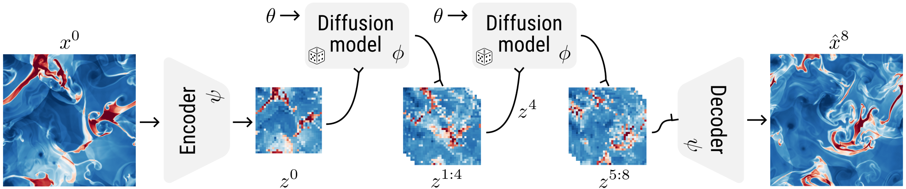

# Lost in Latent Space

This repository contains the official implementation of the paper [Lost in Latent Space: An Empirical Study of Latent Diffusion Models for Physics Emulation](https://arxiv.org/abs/2507.02608) by [François Rozet](https://github.com/francois-rozet), [Ruben Ohana](https://github.com/rubenohana), [Michael McCabe](https://github.com/mikemccabe210), [Gilles Louppe](https://github.com/glouppe), [François Lanusse](https://github.com/EiffL), and [Shirley Ho](https://github.com/shirleysurelyho).

#### Abstract

The steep computational cost of diffusion models at inference hinders their use as fast physics emulators. In the context of image and video generation, this computational drawback has been addressed by generating in the latent space of an autoencoder instead of the pixel space. In this work, we investigate whether a similar strategy can be effectively applied to the emulation of dynamical systems and at what cost. We find that the accuracy of latent-space emulation is surprisingly robust to a wide range of compression rates (up to 1000x). We also show that diffusion-based emulators are consistently more accurate than non-generative counterparts and compensate for uncertainty in their predictions with greater diversity. Finally, we cover practical design choices, spanning from architectures to optimizers, that we found critical to train latent-space emulators.

<p align="center"></p>

## Code

The majority of the code is written in [Python](https://www.python.org). Neural networks are implemented and trained using the [PyTorch](https://github.com/pytorch/pytorch) automatic differentiation framework. To run the experiments, it is necessary to have access to a [Slurm](https://slurm.schedmd.com) cluster, to login to a [Weights & Biases](https://wandb.ai) account and to install the [lola](lola) module as a package.

First, create a new Python environment, for example with [venv](https://docs.python.org/3/library/venv.html).

```
python -m venv ~/.venvs/lola
source ~/.venvs/lola/bin/activate
```

Then, install the [lola](lola) module as an [editable](https://pip.pypa.io/en/latest/topics/local-project-installs) package with its dependencies.

```
pip install --editable .[all] --extra-index-url https://download.pytorch.org/whl/cu121
```

Optionally, we provide [pre-commit hooks](pre-commit.yaml) to automatically detect code issues.

```
pre-commit install --config pre-commit.yaml
```

### Organization

The [lola](lola) directory contains the implementations of the [neural networks](lola/nn), the [autoencoders](lola/autoencoders.py), the [diffusion models](lola/diffusion.py), the [emulation routines](lola/emulation.py), and others.

The [experiments](experiments) directory contains the training scripts, the evaluation scripts and their [configurations](experiments/configs). The [euler](experiments/euler), [rayleigh_benard](experiments/rayleigh_benard) and [gravity_cooling](experiments/gravity_cooling) directories contain the notebooks that produced the figures of the paper.

### Data

We rely on a [Ceph File System](https://docs.ceph.com/en/latest/cephfs) partition to store the data. If your cluster uses a different file system, we recommend to create a symbolic link in your home folder.

```
ln -s /mnt/filesystem/users/you ~/ceph
```

The datasets (Euler, Rayleigh-Bénard and Turbulence Gravity Cooling) are downloaded from [The Well](https://github.com/PolymathicAI/the_well).

```
the-well-download --base-path ~/ceph/the_well --dataset euler_multi_quadrants_openBC
the-well-download --base-path ~/ceph/the_well --dataset euler_multi_quadrants_periodicBC
the-well-download --base-path ~/ceph/the_well --dataset rayleigh_benard
the-well-download --base-path ~/ceph/the_well --dataset turbulence_gravity_cooling
```

> This could take a while!

### Experiments

We start with training the autoencoders. For clarity, we provide the commands for a single compression rate. To replicate the other experiments, modify the number of latent channels.

```
python train_ae.py dataset=euler_all optim.learning_rate=1e-5 ae.lat_channels=64
python train_ae.py dataset=rayleigh_benard optim.learning_rate=1e-5 ae.lat_channels=64
python train_ae.py dataset=gravity_cooling optim.learning_rate=1e-5 ae=dcae_3d_f8c64_large ae.lat_channels=64
```

Each `train_*.py` script schedules a Slurm job to train a model, log the training statistics with `wandb`, and store the weights in the `~/ceph/lola/runs` directory. You will likely have to adapt the requested resources, either in the [config files](experiments/configs) or in the command line. You can inspect the training logs with the `dawgz` command.

```
dawgz       # list all submitted workflows
dawgz 7     # list all jobs in the 7th workflow
dawgz -1 0  # show the logs of the first job in the last workflow
```

Once the above jobs are completed (1-4 days), we encode the entire dataset with each trained autoencoder and cache the resulting latent trajectories permanently on disk. For instance, for the autoencoder run named `1e3z5x2c_rayleigh_benard_dcae_f32c64_large`,

```
python cache_latents.py dataset=rayleigh_benard split=train repeat=4 run=~/ceph/lola/runs/ae/1e3z5x2c_rayleigh_benard_dcae_f32c64_large
python cache_latents.py dataset=rayleigh_benard split=valid run=~/ceph/lola/runs/ae/1e3z5x2c_rayleigh_benard_dcae_f32c64_large
```

The stored latent trajectories are then used to train latent-space emulators (deterministic and diffusion-based), without needing to load and encode high-dimensional samples on the fly.

```
python train_surrogate.py dataset=rayleigh_benard ae_run=~/ceph/lola/runs/ae/1e3z5x2c_rayleigh_benard_dcae_f32c64_large  # neural solver
python train_diffusion.py dataset=rayleigh_benard ae_run=~/ceph/lola/runs/ae/1e3z5x2c_rayleigh_benard_dcae_f32c64_large  # diffusion model
```

We also train pixel-space deterministic emulators, which require more compute resources.

```
python train_surrogate.py dataset=euler_all surrogate=vit_pixel compute.nodes=2
python train_surrogate.py dataset=rayleigh_benard surrogate=vit_pixel compute.nodes=2
```

Finally, we evaluate each trained emulator on the test set.

```
python eval.py start=16 seed=0 run=~/ceph/lola/runs/sm/2k83f6km_rayleigh_benard_f32c64_vit_large  # neural solver
python eval.py start=16 seed=0 run=~/ceph/lola/runs/dm/ny04m1tl_rayleigh_benard_f32c64_vit_large  # diffusion model
```

The results will be compiled in CSV files at `~/ceph/lola/results`.

### Pre-trained models

We provide the weights of all models evaluated in the paper. Note that latent emulators rely on an autoencoder whose weights are provided separately. Please refer to the evaluation notebooks in the [experiments](experiments) directory for examples of loading and using trained models.

<details>
<summary>List of models</summary>

| Dataset | Model           | Compression | Size  | Links                                                                                                                    |
| :------ | :-------------- | ----------: | ----: | :----------------------------------------------------------------------------------------------------------------------- |
| Euler   | Neural solver   |          -- | 3.3GB | [weights](https://users.flatironinstitute.org/~polymathic/data/lola/sm/1y8qrgee_euler_all_pixel_vit_pixel.zip)           |
| Euler   | Autoencoder     |          80 | 907MB | [weights](https://users.flatironinstitute.org/~polymathic/data/lola/ae/n6g8kix8_euler_all_dcae_f32c64_large.zip)         |
| Euler   | Diffusion model |          80 | 851MB | [weights](https://users.flatironinstitute.org/~polymathic/data/lola/dm/e7xzovde_euler_all_f32c64_vit_large.zip)          |
| Euler   | Neural solver   |          80 | 850MB | [weights](https://users.flatironinstitute.org/~polymathic/data/lola/sm/s259b4l6_euler_all_f32c64_vit_large.zip)          |
| Euler   | Autoencoder     |         320 | 904MB | [weights](https://users.flatironinstitute.org/~polymathic/data/lola/ae/8f21pxzs_euler_all_dcae_f32c16_large.zip)         |
| Euler   | Diffusion model |         320 | 850MB | [weights](https://users.flatironinstitute.org/~polymathic/data/lola/dm/oy7s3wfq_euler_all_f32c16_vit_large.zip)          |
| Euler   | Neural solver   |         320 | 850MB | [weights](https://users.flatironinstitute.org/~polymathic/data/lola/sm/95zfkk6w_euler_all_f32c16_vit_large.zip)          |
| Euler   | Autoencoder     |        1280 | 903MB | [weights](https://users.flatironinstitute.org/~polymathic/data/lola/ae/z522jsw5_euler_all_dcae_f32c4_large.zip)          |
| Euler   | Diffusion model |        1280 | 850MB | [weights](https://users.flatironinstitute.org/~polymathic/data/lola/dm/otocl205_euler_all_f32c4_vit_large.zip)           |
| Euler   | Neural solver   |        1280 | 850MB | [weights](https://users.flatironinstitute.org/~polymathic/data/lola/sm/a3hc2as6_euler_all_f32c4_vit_large.zip)           |
| RB      | Neural solver   |          -- | 3.3GB | [weights](https://users.flatironinstitute.org/~polymathic/data/lola/sm/43iu4768_rayleigh_benard_pixel_vit_pixel.zip)     |
| RB      | Autoencoder     |          64 | 1.2GB | [weights](https://users.flatironinstitute.org/~polymathic/data/lola/ae/1e3z5x2c_rayleigh_benard_dcae_f32c64_large.zip)   |
| RB      | Diffusion model |          64 | 851MB | [weights](https://users.flatironinstitute.org/~polymathic/data/lola/dm/ny04m1tl_rayleigh_benard_f32c64_vit_large.zip)    |
| RB      | Neural solver   |          64 | 850MB | [weights](https://users.flatironinstitute.org/~polymathic/data/lola/sm/2k83f6km_rayleigh_benard_f32c64_vit_large.zip)    |
| RB      | Autoencoder     |         256 | 1.2GB | [weights](https://users.flatironinstitute.org/~polymathic/data/lola/ae/jiof10wl_rayleigh_benard_dcae_f32c16_large.zip)   |
| RB      | Diffusion model |         256 | 850MB | [weights](https://users.flatironinstitute.org/~polymathic/data/lola/dm/e0sdjqy9_rayleigh_benard_f32c16_vit_large.zip)    |
| RB      | Neural solver   |         256 | 850MB | [weights](https://users.flatironinstitute.org/~polymathic/data/lola/sm/yubzc3d1_rayleigh_benard_f32c16_vit_large.zip)    |
| RB      | Autoencoder     |        1024 | 1.2GB | [weights](https://users.flatironinstitute.org/~polymathic/data/lola/ae/8brbetky_rayleigh_benard_dcae_f32c4_large.zip)    |
| RB      | Diffusion model |        1024 | 850MB | [weights](https://users.flatironinstitute.org/~polymathic/data/lola/dm/6hsjhmvw_rayleigh_benard_f32c4_vit_large.zip)     |
| RB      | Neural solver   |        1024 | 850MB | [weights](https://users.flatironinstitute.org/~polymathic/data/lola/sm/xqm575ny_rayleigh_benard_f32c4_vit_large.zip)     |
| TGC     | Autoencoder     |          48 | 2.8GB | [weights](https://users.flatironinstitute.org/~polymathic/data/lola/ae/dnzp6wv7_gravity_cooling_dcae_3d_f8c64_large.zip) |
| TGC     | Diffusion model |          48 | 855MB | [weights](https://users.flatironinstitute.org/~polymathic/data/lola/dm/5cywlsx8_gravity_cooling_f8c64_vit_large.zip)     |
| TGC     | Neural solver   |          48 | 854MB | [weights](https://users.flatironinstitute.org/~polymathic/data/lola/sm/e21q2faa_gravity_cooling_f8c64_vit_large.zip)     |
| TGC     | Autoencoder     |         192 | 2.8GB | [weights](https://users.flatironinstitute.org/~polymathic/data/lola/ae/0zc7afa4_gravity_cooling_dcae_3d_f8c16_large.zip) |
| TGC     | Diffusion model |         192 | 854MB | [weights](https://users.flatironinstitute.org/~polymathic/data/lola/dm/2cxh0m26_gravity_cooling_f8c16_vit_large.zip)     |
| TGC     | Neural solver   |         192 | 854MB | [weights](https://users.flatironinstitute.org/~polymathic/data/lola/sm/5rtbuoht_gravity_cooling_f8c16_vit_large.zip)     |
| TGC     | Autoencoder     |         768 | 2.8GB | [weights](https://users.flatironinstitute.org/~polymathic/data/lola/ae/gf09iy5g_gravity_cooling_dcae_3d_f8c4_large.zip)  |
| TGC     | Diffusion model |         768 | 854MB | [weights](https://users.flatironinstitute.org/~polymathic/data/lola/dm/6xekmygr_gravity_cooling_f8c4_vit_large.zip)      |
| TGC     | Neural solver   |         768 | 854MB | [weights](https://users.flatironinstitute.org/~polymathic/data/lola/sm/5haia87a_gravity_cooling_f8c4_vit_large.zip)      |

</details>

## Citation

If you find this project useful for your research, please consider citing

```bib
@inproceedings{rozet2025lost,
  title={Lost in Latent Space: An Empirical Study of Latent Diffusion Models for Physics Emulation},
  author = {Fran{\c{c}}ois Rozet and Ruben Ohana and Michael McCabe and Gilles Louppe and Fran{\c{c}}ois Lanusse and Shirley Ho},
  booktitle={The Thirty-ninth Annual Conference on Neural Information Processing Systems},
  year={2025},
  url={https://openreview.net/forum?id=xoNrbfbekM}
}
```

## Acknowledgements

We thank Géraud Krawezik and the Scientific Computing Core at the Flatiron Institute, a division of the Simons Foundation, for the compute facilities and support. We gratefully acknowledge use of the research computing resources of the Empire AI Consortium, Inc., with support from the State of New York, the Simons Foundation, and the Secunda Family Foundation. Polymathic AI acknowledges funding from the Simons Foundation and Schmidt Sciences, LLC.
